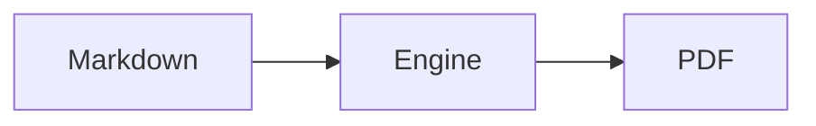

## Getting started

Open the editor and start typing: the Paper Canvas beside the editor
repaginates as you write, so the page you see is the page that prints.

1. Write or paste Markdown into the editor pane.
2. Shape the page with the Inspector on the right — paper size, margins, the
   Preset, header and footer (see [Presets and style settings](#presets-and-style-settings)).
3. Export with the Export button: every plan can save the PDF from the
   browser's own print dialog (see [Exporting](#exporting)).

Your Documents live in your browser — the Library panel lists them, and they
are still there when you come back. No account is needed for any of it.

## Page Breaks

A `///` on its own line is a Page Break: everything after it starts on a new
page.

```markdown
End of the first page.

///

This starts on page two.
```

A `---` horizontal rule is not a Page Break — it draws a rule inside the
current page. Page Breaks also split sections apart: content before a `///`
never reflows across it, and headings after one start their page immediately.

## Presets and style settings

The Inspector's four tabs hold every style value a Document has:

- **Page** — paper size, orientation, and margins. The page box itself is
  never CSS (see [the styling reference](#styling-reference)).
- **Style** — a Preset (a named bundle of typography and colors), the body
  and code fonts, spacing, and the colors. The gallery's **Custom
  stylesheet** tile turns your own CSS layer on and off over any Preset —
  see [the styling reference](#styling-reference) for what that CSS may rely on.
- **Stylesheet** — the Custom Stylesheet box itself, for Pro and Premium.
- **Header/Footer** — the bands at the top and bottom of every page: text,
  page numbers, borders, and banner images. Bands are Inspector settings,
  not CSS.

The **Outline** is the bookmark tree embedded in the exported PDF from the
Document's headings — PDF readers show it in their side panel. It is not a
visible table of contents; nothing TOC-shaped is inserted into the Document.

## Math, diagrams, and tables

Math is typeset with KaTeX. Wrap it in dollars — `$E = mc^2$` inline, or a
displayed equation with `$$…$$`:

$$\int_0^1 x^2 \, dx = \frac{1}{3}$$

Diagrams are `mermaid` fenced code blocks, rendered to SVG in the preview and
in every export:



Tables are GitHub-flavored Markdown:

| Feature | Free | Paid |
| --- | --- | --- |
| Client Export | yes | yes |
| Server Export | — | yes |

## Fonts

The font pickers list what ships with the app or the browser — no font is
ever fetched from a third party:

- **Body:** Georgia, Times New Roman, Helvetica, Arial, Inter, System sans.
- **Code:** Courier New, Consolas, Menlo, System monospace.

Pro and Premium can load a body font and a code font you upload or pick from
your device; uploaded faces are embedded into exports so the PDF matches the
preview.

## Exporting

Two ways to a PDF, one engine:

- **Client Export** — free, unmetered, no account. The browser's own print
  pipeline produces the PDF from the same rendering the preview shows.
- **Server Export** — paid plans, one click. The server renders the PDF with
  headless Chromium and returns the file. It consumes the plan's monthly
  Quota (Pro 300/mo, Premium 1000/mo; pages per export capped at the plan's
  page cap). Premium adds the priority render queue and keeps Server Export
  PDFs in Export History for 30 days.

## Plans, Quota, and Comps

Everything on this page up to here is free and account-less. Pro and Premium
unlock Server Export, custom page sizes, the Custom Stylesheet, custom fonts,
and header/footer and background images — every paid feature at both tiers;
Premium raises the Quota and page cap and adds the queue and history.

Plans are manual crypto payments (USDT or Litecoin), verified by hand, for 1,
3, 6, or 12 months. **Nothing auto-renews** — Plan Expiry is the date your
entitlement ends.

The **Quota** is the monthly number of Server Exports the plan allows. A
**Comp** is extra allowance the operator grants on top of it for one period.
A spent Quota refills at the start of the next month.

## Self-hosting

The whole app — editor, engine, and server — is AGPL-3.0 free software. Run
your own instance with Docker Compose:

```bash
git clone https://github.com/ShrekBytes/perfectMarkD
cd perfectMarkD
cp .env.example .env   # then fill in the four secrets it asks for
docker compose up -d --build
```

Caddy serves the app and reverse-proxies the API. The self-hosted instance
makes no third-party requests; nothing in it phones home. AI is absent until
you configure a provider yourself, and once you do, AI Actions are the only
thing that leaves the instance.

## Privacy FAQ

**Where do my Documents live?**
In your browser. Free-tier Documents are stored in your browser's own
database and never uploaded — there is nothing to leak.

**What does the server see?**
Nothing unless you use Server Export. A Server Export payload is processed
in memory and deleted immediately after rendering. Premium's Export History
keeps Server Export PDFs for 30 days, encrypted at rest, so you can
re-download them.

**Who gets my payment details?**
Only what you submit with the Order: a transaction ID and the amount. There
is no card processor — payments are manual crypto.

**Do the Docs pages or fonts load from third parties?**
No. The fonts are self-hosted and these pages are static files from the same
origin.

**What about AI Actions?**
They are the one thing that leaves your browser. `/ai` and `/ss` send the
text you submit — and, for a large Document, an outline digest of the rest —
to an external AI provider to produce a proposal. Nothing is stored here, and
the commands do not exist at all on an instance whose Admin has not
configured a provider.
