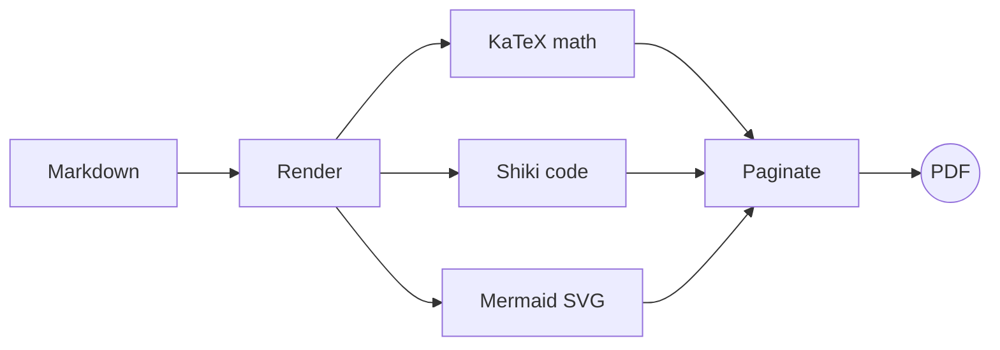

# PerfectMarkD

### Beautiful PDFs from plain markdown

Write markdown on the left — print-perfect pages appear on the right. This
sample tours the layout engine: headings, callouts, tables, highlighted code,
math, and diagrams, all paginated into the PDF you will export.

> [!TIP]
> Everything here is live. Edit the text and the pages reflow as you type —
> Client Export is free, so what you preview is exactly what you print.

///

## Writing stays simple

Headings do double duty: they structure the page and become the PDF outline —
the bookmark tree in your reader's sidebar.

> [!NOTE]
> GitHub-style callouts render as colored panels: NOTE, TIP, IMPORTANT,
> WARNING, and CAUTION.

### Lists and links

- Documents live **entirely in your browser** — nothing is uploaded
- [Links](https://example.com) stay clickable in the exported PDF
- Inline `code` and shortcuts like Ctrl + Enter fit right into prose

1. Write markdown
2. Adjust the page in the Inspector
3. Export

> Ordinary blockquotes work too — this one wears the accent-colored edge.

///

## Tables and code

| Feature                        | Free | Pro |
| ------------------------------ | :--: | :-: |
| Editor and Paper Canvas        |  ✓   |  ✓  |
| Client Export (print pipeline) |  ✓   |  ✓  |
| Server Export (paid plans)     |  —   |  ✓  |
| Export History (30 days)       |  —   |  ✓  |

```ts
// Pages are measured against real layout boxes, not guesses.
export function paginate(source: string, box: Size): Page[] {
  const pages: Page[] = [];
  let rest = render(source);
  while (!isEmpty(rest)) {
    pages.push(fillPage(rest, box));
    rest = remainder(rest, box);
  }
  return pages;
}
```

///

## Mathematics

KaTeX renders math inline — the quadratic formula
$x = \frac{-b \pm \sqrt{b^2 - 4ac}}{2a}$ sits right inside a sentence — and in
display mode:

$$
\int_{-\infty}^{\infty} e^{-x^2} dx = \sqrt{\pi}
$$

///

## Diagrams

Mermaid turns fenced blocks into vector diagrams:



## The page itself

This page carries the page frame and the footer page numbers — both are
settings in the Inspector on the right, along with presets, fonts, colors, and
page sizes.

> [!WARNING]
> This is a sample document. Edit it, clear it, or start blank — nothing here
> is precious.

---

_Made with PerfectMarkD — markdown in, perfectly laid-out PDFs out._
